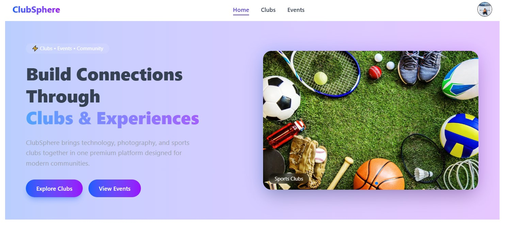
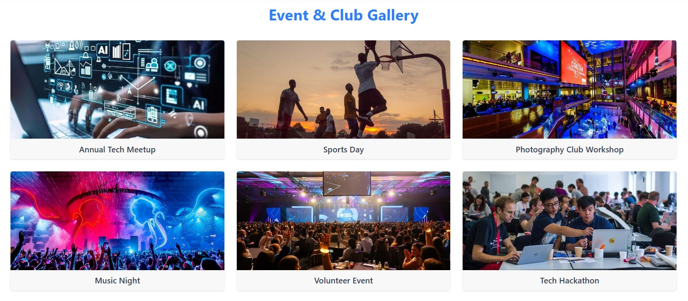
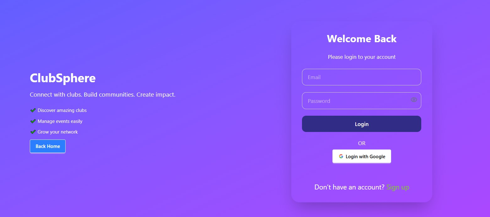

# ClubSphere Platform

**Project Name:** ClubSphere
**Purpose:** ClubSphere is a web application that helps people discover, join, and manage local clubs (for example: photography clubs, hiking groups, book clubs, tech clubs). Through ClubSphere, club managers can create and manage clubs and events, and members can join clubs, pay membership fees, and register for events. An admin oversees the entire platform.


A modern, responsive, and user-friendly **React +Nodejs+MongoDB+ Firebase** web application with smooth animations, secure authentication, and an engaging UI.

## 🚀 Live Demo

🔗 Netlify: [View Live Project](https://clubsphere-anik.netlify.app/)

---

**How to Run Locally:**  
```bash
npm install 
npm run dev
```


## 📸 Screenshots

### 🏠 Home Page



### 📰 Gallary


### 🔐 Sign Up Page



### 🏠 Home Page


---


⭐ **Don’t forget to give this repo a star if you like it!**